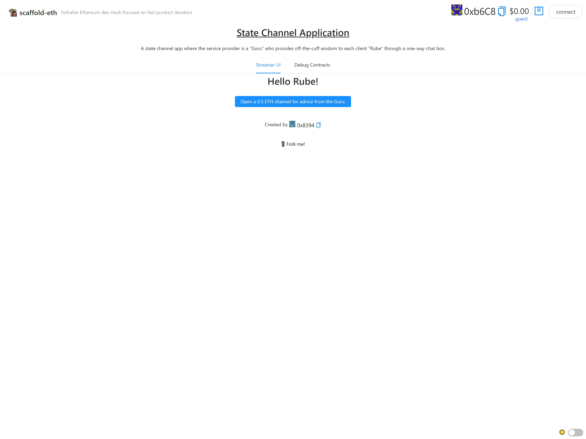

# 📺 State Channel Application

This is my solution to [Speed Run Ethereum](https://speedrunethereum.com/)'s A State Channel Application Challenge.

## Table of contents

- [About the challenge](#about-the-challenge)
- [What I built](#what-i-built)
- [Screenshot](#screenshot)
- [Links](#links)
- [Getting Started](#getting-started)
  - [Installation](#installation)
  - [Change network](#change-network)
  - [Setup environment](#setup-environment)
- [Author](#author)
- [Acknowledgments](#acknowledgments)

## About the challenge

This challenge is about the creation of a simple state channel application, where users seeking a service lock collateral on-chain with a single transaction, interact with their service provider entirely off-chain, and finalize the interaction with a second on-chain transaction.

Read about the challenge and code at the repo of the challenge here: https://github.com/scaffold-eth/scaffold-eth-challenges/tree/challenge-9-state-channels

## What I built

In this challenge, I accomplished to:

- 🛣️ Build a `Streamer.sol` contract that collects **ETH** from numerous client addresses using a payable `fundChannel()` function and keeps track of `balances`.
- 💵 Exchange paid services off-chain between the `Streamer.sol` contract owner (the **Guru**) and **rube** clients with funded channels. The **Guru** provides the service in exchange for signed vouchers which can later be redeemed on-chain.
- ⏱ Create a Challenge mechanism with a timeout, so that **rubes** are protected from a **Guru** who goes offline while funds are locked on-chain (either by accident, or as a theft attempt).
- ⁉ Consider some security / usability holes in the current design.

## Screenshot



## Links

Live Demo: https://state-channel-app-ds.surge.sh/

Etherscan Contract: https://goerli.etherscan.io/address/0xcE3A62Ef321a2120f91946Eea0CaD66eB1056F73

## Getting Started

### Installation

```bash
git clone https://github.com/dalvinderjitsingh/state-channel-app.git state-channel-app
cd state-channel-app
yarn install
```

---

### Change network

Change the network to localhost to deploy on Hardhat instead of Goerli.

📡 Edit the `defaultNetwork` to localhost in `packages/hardhat/hardhat.config.js`

📝 Edit the `targetNetwork` in `App.jsx` (in `packages/react-app/src`) to localhost.

---

### Setup environment

You'll have three terminals up for:

```bash
yarn chain   (hardhat backend)
yarn start   (react app frontend)
yarn deploy  (to compile, deploy, and publish your contracts to the frontend)
```

💻 View your frontend at http://localhost:3000/

👩‍💻 Rerun `yarn deploy --reset` whenever you want to deploy new contracts to the frontend.

---

## Author

- Name - Dalvinderjit Singh
- Website - [dalvinderjitsingh.github.io](https://dalvinderjitsingh.github.io/)
- LinkedIn - [Dalvinderjit Singh](https://www.linkedin.com/in/dalvinderjit-singh-a40b511b7/)
- Twitter - [@dalvinderjit01](https://twitter.com/dalvinderjit01)

## Acknowledgments

I want to thank all the people involved in creating and running the Speed Run Ethereum challenges. This challenge was a great learning experience. I also want to thank all the people who made the resources which were utilised in developing this project.
